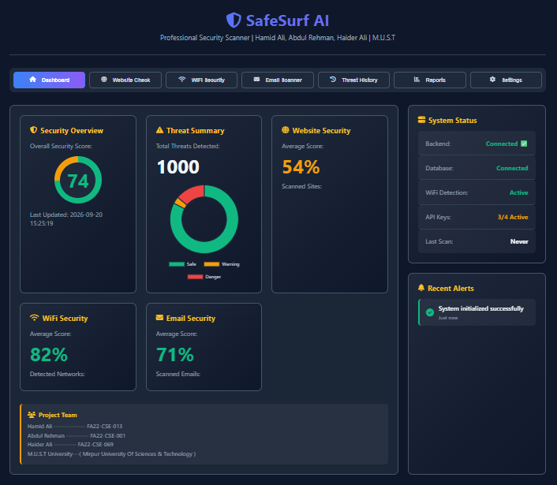
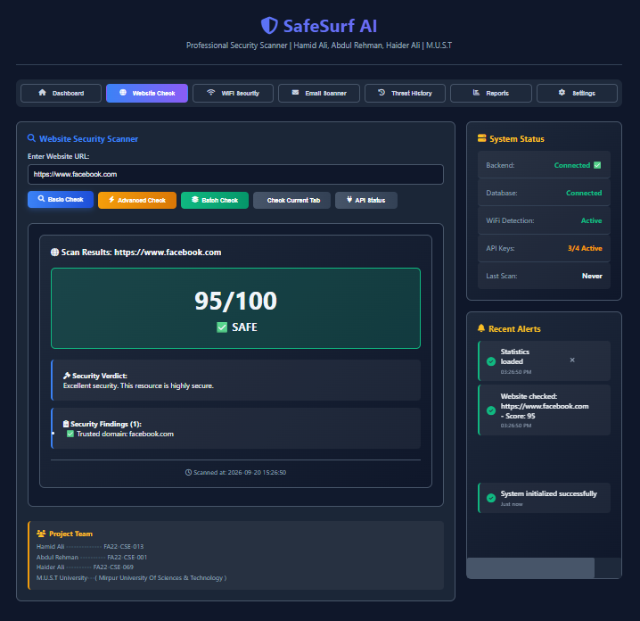
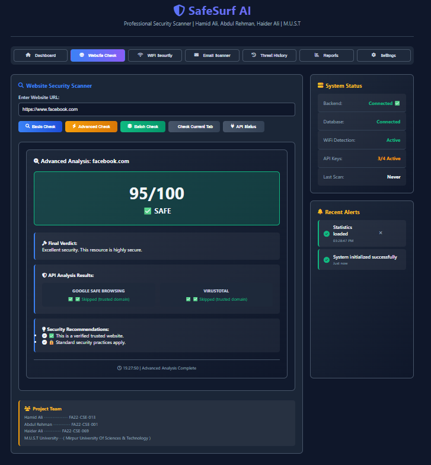
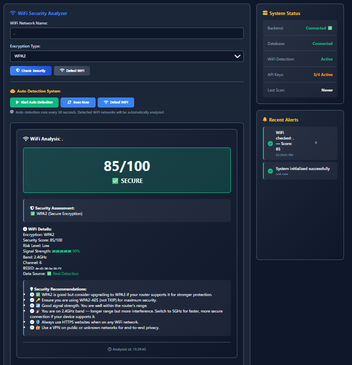
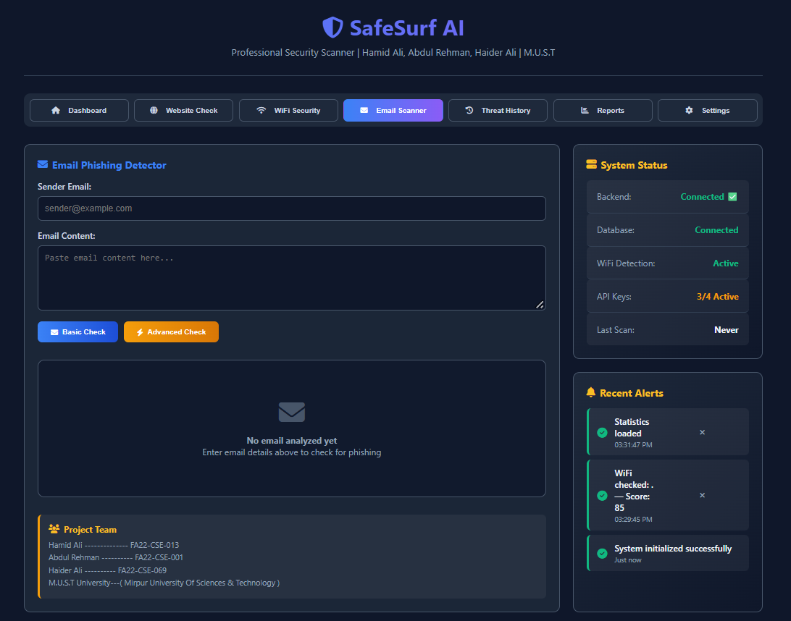
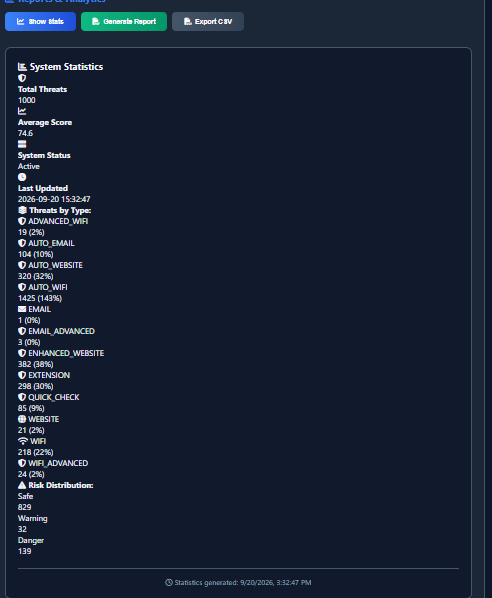
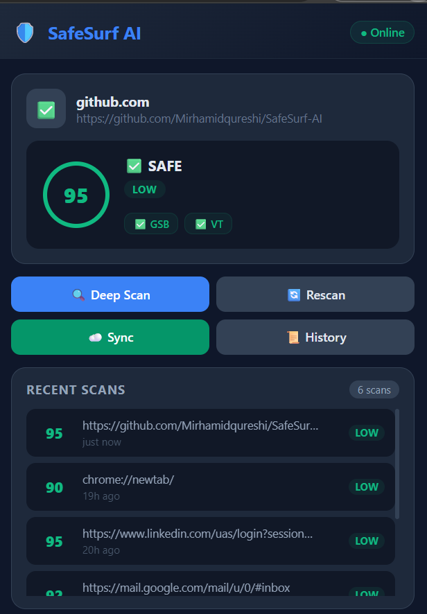

# 🛡️ SafeSurf AI — Real-Time Cybersecurity Scanner

<div align="center">


[](https://python.org)
[](https://flask.palletsprojects.com)
[](https://developer.chrome.com/docs/extensions/)
[](LICENSE)
[](https://must.edu.pk)

**AI-powered real-time cybersecurity scanner — detects phishing websites, insecure WiFi networks, and email phishing attempts.**

[Features](#-features) • [Screenshots](#-screenshots) • [Setup Guide](#-local-setup) • [API Keys](#-api-keys-required) • [Chrome Extension](#-chrome-extension-setup) • [Team](#-project-team)

</div>

---

## 👨‍💻 Project Team

| Name | Roll Number | Role |
|------|-------------|------|
| **Hamid Ali** | FA22-CSE-013 | Lead Developer |
| **Abdul Rehman** | FA22-CSE-001 | Backend & APIs |
| **Haider Ali** | FA22-CSE-069 | Frontend & Extension |

> 🎓 **Final Year Project (FYP)** — Mirpur University of Sciences & Technology (M.U.S.T)

---

## ✨ Features

| Feature | Description |
|---------|-------------|
| 🌐 **Website Scanner** | Checks URLs against Google Safe Browsing, VirusTotal, AbuseIPDB & custom phishing detection |
| 🔍 **Advanced Analysis** | Deep scan with multi-API results, verdict, and security recommendations |
| 📦 **Batch URL Check** | Scan up to 5 URLs at once |
| 📶 **WiFi Security Analyzer** | Detects insecure networks (WEP/Open), real-time WiFi monitoring |
| 📧 **Email Phishing Detector** | Analyzes sender, content, and links for phishing indicators |
| 🔌 **Chrome Extension** | Real-time browser protection with popup scanner (Manifest V3) |
| 📊 **Dashboard & Reports** | Threat history, statistics, CSV/PDF export |
| 🔊 **Audio Alerts** | Sound alerts for Danger / Warning / Safe results |
| 🗄️ **Threat Database** | SQLite database storing all scan history |
| 🚦 **Rate Limiting** | Per-IP, per-endpoint rate limiting built-in |

---

## 📸 Screenshots

### 🖥️ Dashboard


### 🌐 Website Scanner


### 🔍 Advanced Website Analysis


### 📶 WiFi Security Analyzer


### 📧 Email Phishing Detector


### 📊 Reports & Statistics


### 🔌 Chrome Extension


---

## 📁 Project Structure

```
SafeSurfAI/
├── backend/                        # Flask REST API
│   ├── app.py                      # Main application (all endpoints)
│   ├── requirements.txt            # Python dependencies
│   ├── .env.example                # Environment variables template
│   ├── trusted_domains.txt         # Trusted domain whitelist
│   ├── threats.db                  # SQLite database (auto-created)
│   └── sounds/                     # Alert audio files
│       ├── Danger.mp3
│       ├── Warning.mp3
│       └── Safe.mp3
│
├── frontend/                       # Web Dashboard
│   ├── index.html                  # Main dashboard UI
│   ├── script.js                   # All frontend logic
│   └── style.css                   # Styling (dark theme)
│
├── SafeSurfExtension/              # Chrome Extension (Manifest V3)
│   ├── manifest.json               # Extension config
│   ├── popup.html                  # Extension popup UI
│   ├── popup.js                    # Popup logic
│   ├── background.js               # Service worker
│   ├── content.js                  # Content script
│   └── icons/                      # Extension icons
│       ├── icon16.png
│       ├── icon48.png
│       └── icon128.png
│
├── screenshots/                    # README screenshots
├── README.md                       # This file
├── FYP_Proposal_Safesurf.pdf       # FYP Proposal document
├── SafeSurf AI FYP Defense.pdf     # Defense presentation (PDF)
├── SafeSurf AI FYP Defense.pptx    # Defense presentation (PPTX)
└── SafeSurf_AI_Final_FYP_Thesis_Report_Final_Updated.docx  # Final thesis
```

---

## ⚙️ Local Setup

### Prerequisites

- Python 3.10 or higher
- Google Chrome browser
- Git

---

### Step 1 — Clone the Repository

```bash
git clone https://github.com/Mirhamidqureshi/SafeSurf-AI.git
cd SafeSurf-AI
```

---

### Step 2 — Backend Setup

```bash
# Go to backend folder
cd backend

# Create virtual environment
python -m venv venv

# Activate virtual environment
# Windows:
venv\Scripts\activate
# Mac/Linux:
# source venv/bin/activate

# Install all dependencies
pip install -r requirements.txt

# Copy environment file
copy .env.example .env        # Windows
# cp .env.example .env        # Mac/Linux

# Add your API keys in .env file (see API Keys section below)
# Then start the server
python app.py
```

✅ Server starts at: **http://127.0.0.1:5000**

You should see:
```
 * Running on http://127.0.0.1:5000
 * Database setup complete
 * Auto-scanner active
```

---

### Step 3 — Frontend Setup

Open a new terminal (keep backend running):

```bash
# Option 1: Simply open in browser (easiest)
# Just double-click frontend/index.html
# OR open it in Chrome directly

# Option 2: Serve with Python
python -m http.server 8080 --directory frontend
# Then open: http://localhost:8080
```

> ⚠️ **Important:** Make sure backend is running at `http://127.0.0.1:5000` before opening frontend.

---

### Step 4 — Chrome Extension Setup

1. Open Chrome and go to: `chrome://extensions/`
2. Enable **Developer Mode** (toggle in top-right corner)
3. Click **"Load unpacked"**
4. Select the `SafeSurfExtension/` folder
5. The 🛡️ SafeSurf AI icon will appear in your toolbar

> The extension connects to `http://localhost:5000` — backend must be running.

---

## 🔑 API Keys Required

Get free API keys and add them to your `backend/.env` file:

| Service | Free Tier | How to Get |
|---------|-----------|------------|
| **Google Safe Browsing** | ✅ Free | [console.cloud.google.com](https://console.cloud.google.com) → Enable "Safe Browsing API" |
| **VirusTotal** | ✅ Free (4 req/min) | [virustotal.com](https://www.virustotal.com/gui/join-us) → Sign up → API Key |
| **AbuseIPDB** | ✅ Free | [abuseipdb.com](https://www.abuseipdb.com/register) → Sign up → API Key |
| **OpenPhish** | Optional | [openphish.com](https://openphish.com) → Contact for access |

### Getting Google Safe Browsing API Key (Step by Step)

1. Go to [Google Cloud Console](https://console.cloud.google.com)
2. Create a new project (or select existing)
3. Go to **APIs & Services** → **Library**
4. Search for **"Safe Browsing API"** → Click **Enable**
5. Go to **APIs & Services** → **Credentials**
6. Click **"Create Credentials"** → **API Key**
7. Copy the key and paste in `.env` file

### .env File Format

```env
GOOGLE_SAFE_BROWSING_API_KEY=your_google_key_here
VIRUSTOTAL_API_KEY=your_virustotal_key_here
ABUSEIPDB_API_KEY=your_abuseipdb_key_here
OPENPHISH_API_KEY=optional_key_here

SERVER_PORT=5000
DEBUG_MODE=True
```

---

## 🌐 API Endpoints Reference

Once backend is running at `http://127.0.0.1:5000`:

| Method | Endpoint | Description |
|--------|----------|-------------|
| `GET` | `/health` | Check if backend is running |
| `POST` | `/check-website` | Basic website security scan |
| `POST` | `/check-website-advanced` | Advanced scan (all APIs) |
| `POST` | `/check-email` | Email phishing check |
| `POST` | `/check-wifi` | WiFi security analysis |
| `GET` | `/get-current-wifi` | Auto-detect connected WiFi |
| `POST` | `/batch-check` | Check multiple URLs at once |
| `GET` | `/get-threats` | Get threat history |
| `GET` | `/stats` | Get system statistics |
| `GET` | `/api-status` | Check API keys status |

### Quick Test (after starting backend)

```bash
# Health check
curl http://127.0.0.1:5000/health

# Check a website
curl -X POST http://127.0.0.1:5000/check-website \
  -H "Content-Type: application/json" \
  -d "{\"url\": \"https://google.com\"}"

# Check WiFi
curl -X POST http://127.0.0.1:5000/check-wifi \
  -H "Content-Type: application/json" \
  -d "{\"wifi_name\": \"HomeWiFi\", \"encryption\": \"WPA2\"}"
```

---

## 🔒 Security Features

This project follows **OWASP Top 10** security practices:

- ✅ Input validation & sanitization on all endpoints
- ✅ Rate limiting (per-IP, per-endpoint)
- ✅ SSRF protection (blocks internal IP scanning)
- ✅ Security headers (CSP, X-Frame-Options, X-XSS-Protection)
- ✅ No secrets in source code (`.env` is gitignored)
- ✅ Parameterized SQLite queries (SQL injection prevention)
- ✅ CORS configured for local origins only

---

## 🚀 Deployment (Render - Free Hosting)

The backend can be deployed on [Render](https://render.com) for free:

1. Fork this repository
2. Go to [render.com](https://render.com) → New → Web Service
3. Connect your GitHub repo
4. Set environment variables (API keys) in Render dashboard
5. Deploy!

See `render.yaml` for deployment configuration.

**Live Demo:** https://safesurf-ai.onrender.com

---

## ❓ Troubleshooting

### Backend won't start
```bash
# Make sure you're in backend folder
cd backend
# Activate virtual environment first
venv\Scripts\activate
# Then run
python app.py
```

### "Module not found" error
```bash
pip install -r requirements.txt
```

### Google Safe Browsing shows 403
- Go to Google Cloud Console
- Make sure "Safe Browsing API" is **enabled** for your project
- Check that your API key has no restrictions, or allow "Safe Browsing API"

### Chrome Extension not connecting
- Make sure backend is running at `http://127.0.0.1:5000`
- Check Chrome extension is loaded from `SafeSurfExtension/` folder
- Click the extension icon → should show "● Online"

### Frontend shows "Backend Offline"
- Start backend first: `python app.py` in `backend/` folder
- Then open `frontend/index.html` in browser

---

## 📄 Documents

| Document | Description |
|----------|-------------|
| 📋 `FYP_Proposal_Safesurf.pdf` | Initial FYP proposal |
| 🎤 `SafeSurf AI FYP Defense.pdf` | Defense presentation (PDF) |
| 📊 `SafeSurf AI FYP Defense.pptx` | Defense presentation (PowerPoint) |
| 📖 `SafeSurf_AI_Final_FYP_Thesis_Report_Final_Updated.docx` | Complete thesis report |

---

## 📜 License

This project is developed for **academic purposes** as a Final Year Project at **Mirpur University of Sciences & Technology (M.U.S.T)**.

---

<div align="center">

Made with ❤️ by **Hamid Ali, Abdul Rehman & Haider Ali**

⭐ If you find this useful, please give it a star!

</div>
